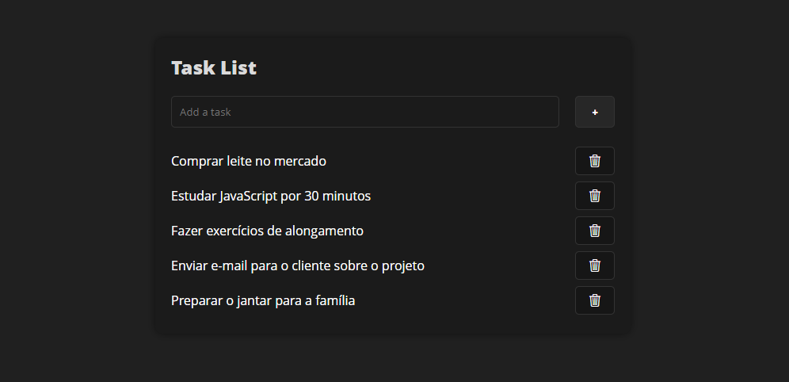

<h1>Task List Panel</h1>

Este é um projeto simples de um painel de tarefas. Nele, você pode adicionar suas tarefas, que ficam salvas em uma lista com um botão para apagar quando a tarefa for concluída.

<h2>Como usar</h2>
<ol>
  <li>Acesse o link https://youtasklist.vercel.app/</li>
  <li>Adicione suas tarefas na caixa de texto "Add task".</li>
  <li>Clique no botão "+" ou tecle "ENTER" para adicionar a tarefa à lista.</li>
  <li>Quando uma tarefa for concluída, clique no botão de lixeira ao lado dela para removê-la da lista.</li>
</ol>

  

## 🚀 Tecnologias

Esse projeto foi desenvolvido com as seguintes tecnologias:

- HTML
- CSS
- JavaScript
